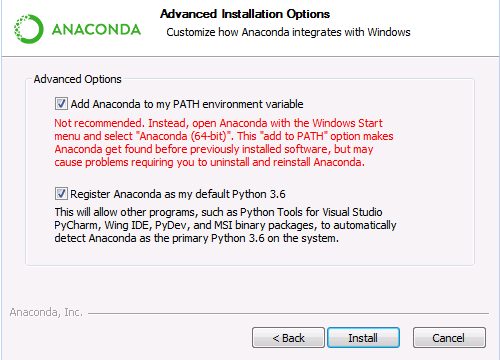

# Install Python & Conda:
Conda package manager gives you the ability to __create multiple environments__ with different versions of Python and other libraries. This becomes useful when some codes are written with specific versions of a library. For example, you define your default TensorFlow environment with python 3.5 and TensorFlow 1.6  with GPU by the name ```tensorflow```. However, you may find another code that runs in python2.7 and has some functions that work with TensorFlow 1.2 with CPU. You can easily create a new environment and name it for example ```tf-12-cpu-py27```. In this way you don’t mess with your default environment and you can create multiple environments for multiple configurations. The figure below might give you some hints:


__1.__ Download and install Miniconda from https://docs.conda.io/projects/miniconda/en/latest/.

__*Note:__ Remember the path that you are installing the Anaconda into. You will later need it for setting the path in PyCharm (we'll dive into it soon).

__(For Windows):__ Make sure to select "Add Miniconda3 to my PATH environment variable".



__2.__ Initialize the conda to be able to use conda in the terminal/command line:

__Linux__: Open terminal, and navigate to the folder Miniconda is installed, run the follwoing commands:

```bash
cd condabin
conda init
```

__Windows__: Navigate to the folder Miniconda is installed, go to __condabin__ folder and in the address bar type, `cmd`. This will open the command line in the folder. Run the following command:

`conda.bat init`


__3.__ Now that the conda is properly installed, we can create a new conda environment and install our python and rest of the packages in the isolated environment. Before installing __TensorFlow__, we need to make sure to install a compatible version of python. We can check the versions in https://www.tensorflow.org/install/source#tested_build_configurations. For example, for `tensorflow-2.10.0` we need __python 3.7__ to __python3.10__. We can create an environment by the name `tensorflow` using the following command:

`conda create -n tensorflow python=3.10`

Once the environment is created, we can activate it using the following command:

`conda activate tensorflow`