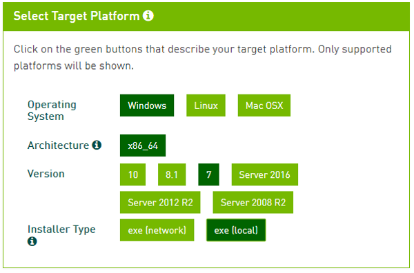
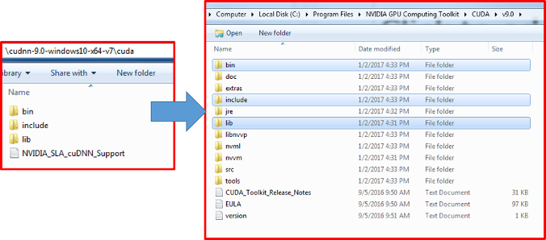

# Install CUDA & cuDNN:

If you want to use the __GPU version__ of the __TensorFlow__ you must have a __cuda-enabled GPU__.

* To check if your GPU is CUDA-enabled, try to find its name in the long [list of CUDA-enabled GPUs](https://developer.nvidia.com/cuda-gpus).
* To verify you have a CUDA-capable GPU:
  * __(for Windows)__ Open the command prompt (click start and write “cmd” on search bar) and type the following command:
  ```bash
  control /name Microsoft.DeviceManager
  ```
  * __(for Linux)__ Open terminal (Alt+Ctrl+T) and type:
  ```bash
  lspci | grep -i nvidia
  ```

You can check https://www.tensorflow.org/install/source#gpu to find the CUDA and cuDNN version for each TensorFlow version you want to install.
For example, for `tensorflow-2.10.0` we will need the following versions:

- CUDA tooklit: 11.2
- cuDNN: 8.1

You can install CUDA & cuDNN in two ways:

__I.  Install from scratch on OS:__ good for installing single version of TensorFlow

__II. Install using conda:__ good for installing multiple versions of TensorFlow


Installing from scratch might be challenging but it gaurranties finding all the versions once you successfully install, it will be robust. On the other hand, installing using conda is easy but you might not be able to find the specific version.

We will provide the instruction for both but __we recommend installing using conda__.


# I. Install from scratch

## Windows:

__1.__ On google, search __download cuda toolkit 11.2__. The first link will be https://developer.nvidia.com/cuda-11.2.0-download-archive. It will ask for setting up an account (it is free). Choose the correct version of your windows and select local installer:



Install the toolkit from downloaded .exe file.

__2.__ Download the cuDNN v8.1 (CUDA for Deep Neural Networks) library from https://developer.nvidia.com/cudnn. Select __Archived cuDNN Releases__, search and Download cuDNN v8.1.1 (Feburary 26th, 2021), for CUDA 11.0,11.1 and 11.2.

Choose the correct version of your Windows. Download the file. Copy the files to “C:\Program FIles\NVIDIA GPU Computing Toolkit\CUDA\v11.2” in the corresponding folders:



## Linux:

__1.__ Download and install the CUDA toolkit 11.2 from https://developer.nvidia.com/cuda-11.2.0-download-archive. Choose the correct version of your Linux and select runfile (local) local installer:


Open terminal (Alt+Ctrl+T) and type:
```bash
chmod +x cuda_11.2.0_460.27.04_linux.run
sudo ./cuda_11.2.0_460.27.04_linux.run --override
```
 __*Note:__ Do not install the Graphics Driver.

 You can verify the installation:
```bash
nvidia-smi
```
Also you can check where your cuda installation path (we will call it as ```<cuda_path>```) is using one of the commands:
```bash
which nvcc
ldconfig -p | grep cuda
```

Your ```<cuda_path>``` will be ```/usr/...``` or ```/usr/local/cuda/``` or ```/usr/local/cuda/cuda-11.2/```. Locate it and add it to your _.bashrc_ file:
```bash
export CUDA_ROOT=<cuda_path>/bin/
export LD_LIBRARY_PATH=<cuda_path>/lib64/
```

__2.__ Download the cuDNN v8.1 (CUDA for Deep Neural Networks) library from https://developer.nvidia.com/cudnn. Select __Archived cuDNN Releases__, search and Download cuDNN v8.1.1 (Feburary 26th, 2021), for CUDA 11.0,11.1 and 11.2.

Choose _cuDNN Library for Linux (x86_64). Go to the folder that you downloaded the file and open terminal (Alt+Ctrl+T):
```bash
tar -xvzf cudnn-11.2-linux-x64-v8.1.1.33.tgz
cd cuda/
sudo cp -P include/cudnn.h <cuda_path>/include
sudo cp -P lib64/libcudnn* <cuda_path>/lib64
sudo chmod a+r <cuda_path>/lib64/libcudnn*
```

__3.__ Install libcupti-dev:
```bash
sudo apt-get install libcupti-dev
 ```

# II. Install using conda

__1.__ Open Terminal (on Linux) or Command Prompt (on Windows) and install `cudatoolkit` package from `nvidia` or `conda-forge` channels:


` conda install cudatoolkit=11.2`

__2.__ Install `cudnn` package from `nvidia` and `conda-forge` channels:

`conda search cudnn=8.1 -c nvidia -c conda-forge`

__*Note:__ if you are installing the packages in a conda environment, don't forget to activate the environment before installing conda packages:

`conda activate tensorflow`
